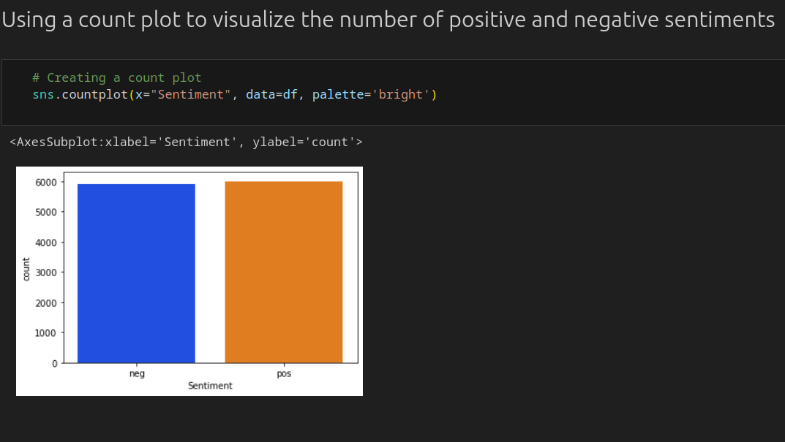

# Text Classification with Naive Bayes

The assignment involved the creation of a text classification model using the Naives Bayes algorithm.
The main objective of the task was to create a model that predicted correctly,
the sentiment of a customer review as either positive or negative.

## Demostration

## The Model

After completion, the model was able to successfully predict with an accuracy of 82%.

## Dataset

The dataset used in this model was provided by the instructor on the institution�s website platform.  
The data had a total of 11,914 observations and 2 variables.

## Data preprocessing

To prepare the data for training, several modifications were carried out to ensure efficiency.  
First, the data was appended to a list to ensure easier transformation. Secondly,
the data was transformed into a data frame to ensure easier interaction and understanding.
Also, and since the data was full of unnecessary words, these words were eliminated to ensure only the relevant and unique words were used.  
Additionally, a frequency operation was applied to the data to allow the counting and matching of words.

## Visualization, Training, Prediction, and Results

For the model,a count plot was used to visualize the number of positive and negative sentiments on the data.
For the training, the Naives Bayes Multinomial algorithm was used for training and prediction. After successful training,
the model was able to predict the testing results with an accuracy of 0.82 or 82%.

## Cross-Validation

A cross-validation was carried out with n=5 fold. The results were similar to the accuracy level as shown on the code.

### Conclusion

With the successful development of the text classification model,
I am certain that the model can classify customers reviews as either positive or negative with an accuracy of 82%.
